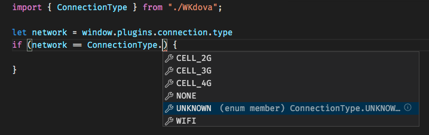

# WKdova

A Swift Package which offers WKWebview turnkey solutions for common tasks. Think of it as a lightweight Cordova.

- [x] Insomania: Prevent display falling asleep.
- [x] NativeStorage: Persistent key/value storage, which will not be cleared by the OS.
- [x] Keychain: Store strings in the Keychain.
- [x] Device information
- [x] mDNS (Bonjour)
- [ ] Global native dialogs
- [ ] Push notification
- [x] network information
- [X] GPS location (requires NSLocationAlwaysAndWhenInUseUsageDescription, NSLocationAlwaysUsageDescription, NSLocationWhenInUseUsageDescription)
- [x] Take picture (requires NSPhotoLibraryUsageDescription, NSCameraUsageDescription)

When should you not use a WKWebView? When you want to access the filesystem, or in general when you need to send lots of data back and forth between the view and the OS.

## Setup

Create a WKWebview

```swift
import WebKit

override func viewDidLoad() {
	super.viewDidLoad()
	let webView = WKWebView(frame: .zero)
	view.addSubview(webView)
	webView.translatesAutoresizingMaskIntoConstraints = false
	NSLayoutConstraint.activate([
		webView.leadingAnchor.constraint(equalTo: view.leadingAnchor, constant: 0),
		webView.trailingAnchor.constraint(equalTo: view.trailingAnchor, constant: 0),
		webView.topAnchor.constraint(equalTo: view.topAnchor, constant: 0),
		webView.bottomAnchor.constraint(equalTo: view.bottomAnchor, constant: 0),
	])
	webView.scrollView.bounces = false;
	webView.scrollView.contentInsetAdjustmentBehavior = .never; // Disable the safe area behaviour.
	webView.isOpaque = false;
	if let url = Bundle.main.url(forResource: "index", withExtension: "html", subdirectory: "") {
		webView.load(URLRequest(url: url))
	}

}
```


Import WKdova package and pass it the webview.

```swift
import WKdova

...
WKdova(webView)
```
And you are ready to use the `window.plugins` in your app.

## Example


```js
if (window.plugins === undefined) {
	// handle if plugin not loaded
}

// insomnia
window.plugins.insomnia.setEnabled(true);
window.plugins.insomnia.isEnabled;

// nativeStorage
window.plugins.nativeStorage.setItem('key', 'value');
window.plugins.nativeStorage.getItem('key', console.log);
window.plugins.nativeStorage.removeItem('key');
window.plugins.nativeStorage.clear();

// keychain
window.plugins.keychain.setItem('key', 'secret');
window.plugins.keychain.getItem('key', console.log);
window.plugins.keychain.removeItem('key')
window.plugins.keychain.clear();

// mDNS (will search for 6 seconds)
window.plugins.mDNS.browse('_http._tcp', console.log);

// pickImage takes maxWidth, callback receives a base64 encoded JPG
window.plugins.camera.pickImage(900, setImage);

// gps coordinates
window.plugins.geolocation.getCurrentPosition(console.log);

// connection type
console.log(window.plugins.connection.type);
window.plugins.connection.getType(console.log);

// utils
window.plugins.utils.openURL('https://www.google.com');

```

## TypeScript definition
Copy TypeScript definition file `WKdova.d.ts` to get the type support and juicy autocomplete.


